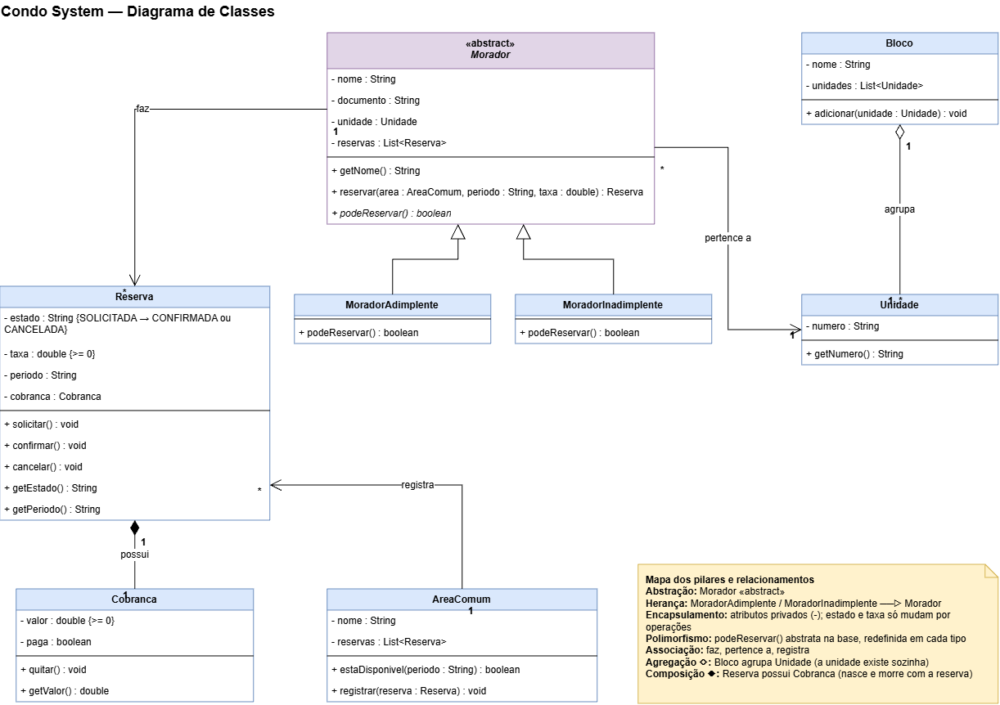

# Condomínio Condo System — Reservas de Áreas Comuns

Sistema para o síndico organizar moradores, unidades e reservas das áreas comuns
(salão de festas, churrasqueira, quadra), substituindo o grupo de WhatsApp.

## O que o sistema faz
- Cadastra moradores, que pertencem a uma unidade; as unidades são agrupadas por bloco.
- O morador reserva uma área comum para um período. A reserva é recusada se a área já
  estiver reservada no mesmo período ou se o morador for inadimplente.
- A reserva só muda de estado por operações (SOLICITADA → CONFIRMADA ou CANCELADA),
  e cada reserva gera a sua cobrança (taxa, nunca negativa).

## Modelagem (diagrama de classes)
- **Abstração:** `Morador` é abstrata.
- **Herança:** `MoradorAdimplente` e `MoradorInadimplente` herdam de `Morador`.
- **Encapsulamento:** atributos privados; estado e taxa só mudam por operações que validam.
- **Polimorfismo:** `podeReservar()` é redefinida em cada tipo de morador.
- **Associação:** Morador faz Reservas; Morador pertence a Unidade; AreaComum registra Reservas.
- **Agregação (◇):** Bloco agrupa Unidades (a unidade existe sem o bloco).
- **Composição (◆):** Reserva possui Cobranca (a cobrança nasce e morre com a reserva).

## Estrutura do repositório
- `diagrama/` — diagrama de classes (`.drawio` para editar em app.diagrams.net e `.png` para visualizar)
- `src/condominio/` — código-fonte em Java
